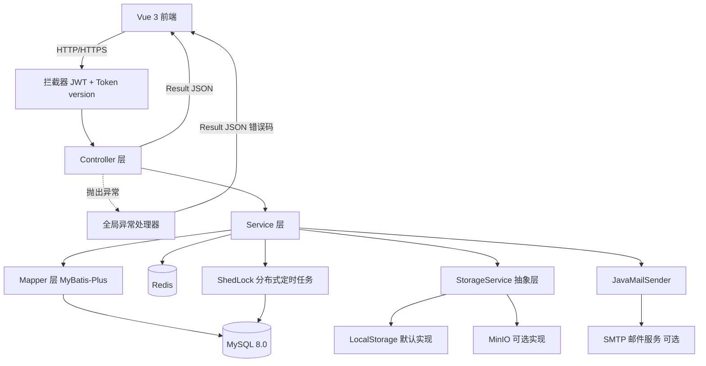
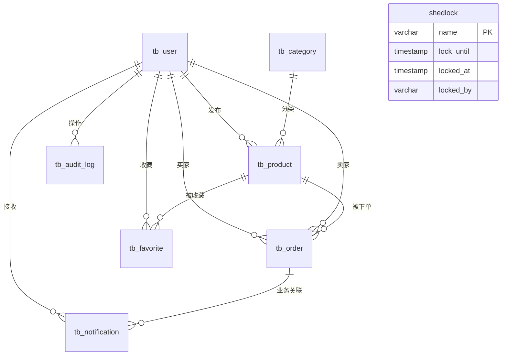
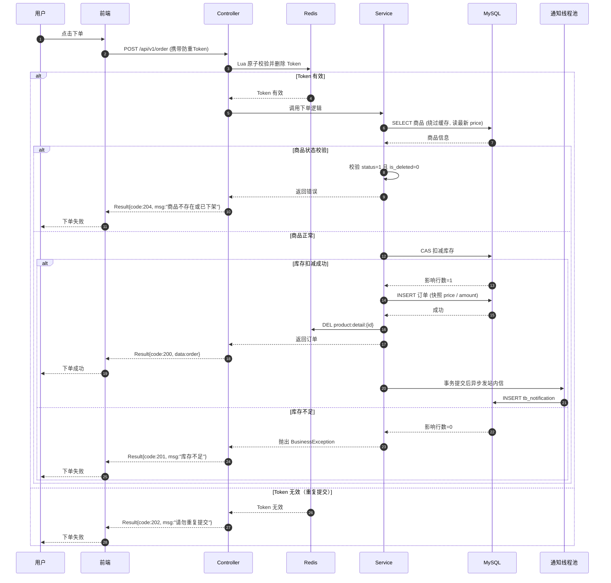
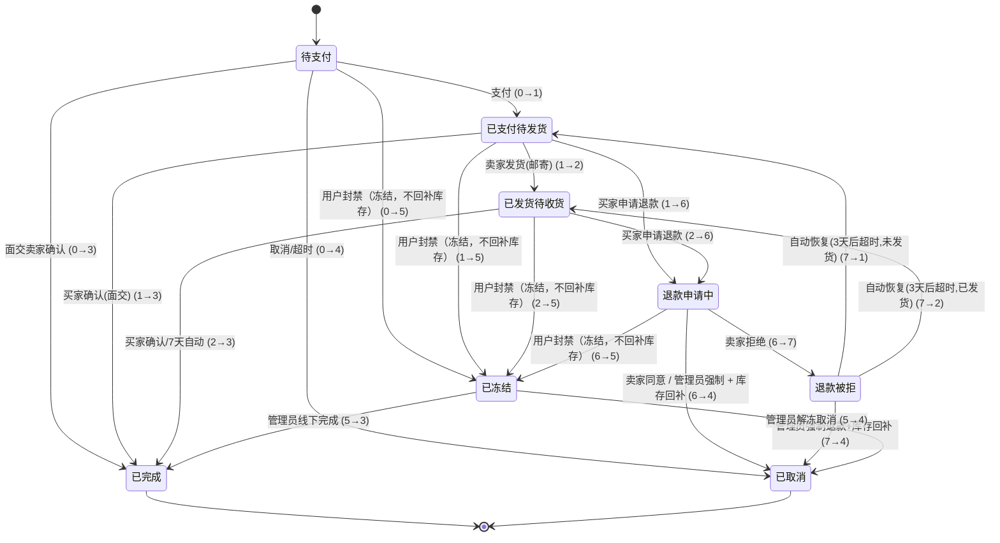

校园二手交易平台 - 项目需求与设计文档 (AI Context 正式封版 V29)
V29 核心变更：新增 3.9.1「库存回补幂等约定」（封禁不回补、只在 5→4 回补、`order:restored:{orderId}` 凭证与回滚释放）、3.9.2「封禁商品状态约定」（下架 `status IN (1,2)`、回补不改状态、下单校验卖家 status、重新上架走 `relistIfSoldOut`）、3.9.3「安全响应头约定」（CSP/HSTS 的下发边界）。技术设计不变，仅追加实现约定与踩坑记录。
V28 核心变更：新增 3.9「安全加固批约定」（6.0.1/6.0.2）：生产 fail-fast 断言范式、支付回调 HMAC 验签（含 fail-closed 与遗留金额校验）、客户端 IP 可信代理与账号计数归一化、生产关接口文档（含"knife4j.enable=false 关不掉 /doc.html"的实测坑）与 Redis 口令取舍。技术设计不变，仅追加实现约定与踩坑记录。
V27 核心变更：新增商品搜索优化（FULLTEXT ngram + LIKE 降级 + 60 秒缓存 + 500ms 熔断，见 3.4.1）、分类逻辑删除让位改名机制与两层缓存说明（见 3.4.2）、唯一键冲突返回 code=100（见 5.1）。技术设计不变，仅追加实现约定与踩坑记录。
V23 核心变更：修复 V22 报告中的 1 项 Blocker（第 7 章与正文不一致）+ 3 项 Major（毕设 MVP 分级、设计图清单、外部依赖降级）+ 3 项 Minor（弱密码简化、Prometheus 可选、创新点定位）。技术设计不变，仅做毕设适配裁剪与文档自洽性修复。

1. 项目概述
项目名称：校园二手交易平台

核心业务：面向校内学生实现二手物品发布、条件检索、商品收藏、下单交易等核心业务。

交易说明：本项目为校园内线下真实交易的辅助平台，系统内“支付”为模拟支付回调，真实资金流转在线下进行。面交订单支持直接 0→3 完成（卖家确认见面交易完成，跳过支付步骤）。

API 版本化：所有接口路径统一使用 /api/v1/ 前缀，预留后续版本演进能力。

毕设创新点（定位）：基于 RAG 的智能商品推荐与语义检索。即使 MVP 阶段仅以接口预留（/api/v1/ai/search）和文档设计呈现，也作为论文创新点在“系统设计”与“未来工作”中展开，区别于普通 CRUD 二手交易系统。

1.1 毕设 MVP 范围分级
P0 · 核心必做：

用户注册/登录（邮箱验证码可跳过，见 3.1 降级方案）

用户级 Token version 机制（V24 从 P1 提升，成本低、安全亮点，答辩演示价值高）

商品 CRUD、分类管理、多条件检索

下单（模拟支付）、订单基础流转（0→1→2→3 / 0→4 / 面交 0→3）

收藏、站内信（写入 + 消费端接口）

管理端审核、封禁、强制下架

CAS 防超卖 + 1000 线程并发测试（论文核心数据）

前端基础页面（登录、首页、商品详情、下单、订单列表、消息中心）

P1 · 可选加分（时间充裕时实现，约 2-3 周）：

退款流程（6/7 状态）、自动确认收货（7 天定时任务）

Redis 缓存（Cache-Aside + 延迟双删 + 故障降级）

审计日志（同事务写入 + 降级）

邮箱验证码完整流程（SMTP 真实发送）

P2 · 未来扩展（论文“未来工作”章节）：

AI RAG 智能导购（Spring AI + ES 8.x + BGE-M3）

Docker 容器化、CI/CD、主从备份、优雅停机、Prometheus 全量指标

1.2 设计图清单（论文第 3 章必备）
文档配套提供以下 4 张核心图表（建议用 draw.io / Mermaid 绘制）：

系统架构图：

本系统采用前后端分离与分层架构设计，系统总体架构如图 3-X 所示。前端基于 Vue 3 构建用户交互界面，通过 HTTP/HTTPS 协议与后端通信。后端基于 Spring Boot 3 框架，采用标准的三层架构：Controller 层负责接收请求与参数校验，Service 层承担核心业务逻辑与事务控制，Mapper 层通过 MyBatis-Plus 完成数据持久化。

为保证系统的安全性与可扩展性，架构中引入了拦截器（Interceptor）统一处理 JWT 鉴权与 Token version 版本校验；同时配备了全局异常处理器（@RestControllerAdvice）统一捕获系统异常并转换为标准错误码返回给前端，确保接口响应的规范性。

在数据存储与外部服务层面，系统采用 MySQL 8.0 作为主数据库，Redis 用于缓存与 Token 管理，并设计了 StorageService 抽象层以支持本地存储（默认）与 MinIO（可选）的无缝切换；邮件服务基于 JavaMailSender 实现，支持 SMTP 发送及开发环境降级开关。此外，系统引入 ShedLock 分布式定时任务锁，确保多实例部署下定时任务（如超时订单扫描、自动确认收货）的幂等性与高可用。

数据库 ER 图

    说明：tb_favorite 采用物理删除；shedlock 为第三方框架表；tb_audit_log 为只追加表，三者均豁免全局字段规则。
系统数据库共包含 8 张数据表，核心实体关系如图 3-X 所示。业务表以用户（tb_user）为中心，向下关联商品（tb_product）、订单（tb_order）、收藏（tb_favorite）、站内信通知（tb_notification）及审计日志（tb_audit_log）。其中，用户与商品为一对多关系，用户与订单存在“买家-卖家”双重一对多关系，商品与收藏、订单与通知均为逻辑关联。

需要说明的是，系统设计采用逻辑外键约束而非物理外键，以提升数据操作的灵活性并规避物理外键带来的性能开销。tb_favorite 表采用物理删除策略，故无 is_deleted 字段；tb_audit_log 表为仅追加的审计表，不设 update_time 与 is_deleted，与 shedlock 第三方框架表一同豁免全局字段规则。

下单时序图：

首先，前端携带防重 Token 发起下单请求，Controller 通过 Lua 脚本在 Redis 中原子校验并删除 Token，若 Token 无效则直接返回“重复提交”（code=202），实现接口幂等保护。

进入核心业务处理后，Service 层需绕过缓存直接查询 MySQL 以获取商品最新价格，随后校验商品状态（status=1 且 is_deleted=0），若商品不存在或已下架则返回 code=204。在库存扣减环节，系统采用 CAS（Compare And Swap）乐观锁机制，通过 UPDATE ... WHERE stock >= quantity 原子扣减库存。若影响行数为 0，则抛出 BusinessException 触发事务回滚，并返回“库存不足”（code=201）；若扣减成功，则写入订单，同时记录商品价格快照、商品标题快照及金额。

订单成功落库后，系统主动删除 Redis 中的商品详情缓存（遵循“先更 DB 再删缓存”策略），最后在事务提交后，通过自定义线程池异步发送站内信通知卖家，避免阻塞主交易流程，确保高并发场景下的系统响应能力。

订单状态机图：

“订单状态机完整流转如下：

正常交易流：待支付(0) 支付后转为 已支付待发货(1)。邮寄订单由卖家发货转为 已发货待收货(2)，买家手动或发货 7 天后自动确认转为 已完成(3)；面交订单跳过 2，由买家确认(1→3)或卖家确认(0→3)转为 已完成(3)。

取消流：待支付(0) 由买家主动取消或超时后转为 已取消(4)，均触发库存回补。

退款流：已支付(1)或已发货(2)的订单，买家可申请退款转为 退款申请中(6)。卖家同意或管理员强制退款后转为 已取消(4)并回补库存；若卖家拒绝，则转为 退款被拒(7)。7 状态保留 3 天申诉期，超时自动恢复为原状态(1或2)，期间买家可申诉由管理员强制退款(7→4)。

冻结流：处于 0/1/2/6 的订单，若用户被封禁则转为 已冻结(5)（**6.0.3 起不执行库存回补** —— 冻结只是暂停交易，回补只在解冻转 5→4 时做一次）。管理员解冻后可转为 已取消(4)或线下处理完成 已完成(3)。”

1.3 技术栈
后端：Java 21, Spring Boot 3, MyBatis-Plus, MySQL 8.0, Redis, JWT, Lombok, Spring Validation, SpringDoc/knife4j, Jackson, ShedLock (shedlock-spring + shedlock-provider-jdbc-template), Spring Boot Mail (JavaMailSender), Spring Security Crypto (仅用于 BCrypt，严禁引入 starter-security)，Spring Boot Actuator，Flyway (数据库版本迁移)。
(注：已移除 Redisson。库存防超卖与回补统一使用 MySQL CAS + 行锁，无需分布式锁。)

Java 核心特性：集合框架、Stream API、多线程与自定义线程池（参数依据：核心 8 基于 4 核 CPU × 2 IO 密集型经验值，最大 16 为突发流量预留，队列 200 为缓冲上限，拒绝策略 CallerRunsPolicy）、IO 流 (文件上传)。

前端：Vue 3 (Composition API), Pinia, Element Plus, Axios, Vue Router。

文件存储（抽象接口）：StorageService 接口，提供 LocalStorageImpl（默认，毕设演示推荐）和 MinioStorageImpl（可选，通过配置切换）。本地磁盘需带大小、类型、像素校验。

AI扩展（后期）：Spring AI, Elasticsearch 8.x (dense_vector + kNN 混合检索), IK 分词器, Ollama/DeepSeek API。

配置管理：JWT secret、SMTP 密码、MinIO 密钥等敏感配置必须通过环境变量或配置中心注入，严禁硬编码。

可观测性（分级）：默认启用 spring-boot-starter-actuator 的 /actuator/health；可选启用 micrometer-registry-prometheus 的 /actuator/prometheus（毕设答辩通常不展示，标注为“可选实现”）。

未来扩展（MVP 不做，仅注明）：Refresh Token 双令牌机制、图片防盗链/私有桶签名 URL、Docker 容器化与 CI 流水线、数据库主从备份与容灾、优雅停机（server.shutdown=graceful）、HikariCP 连接池参数调优、全局限流熔断（Sentinel/Resilience4j）、完整 API 契约文档、数据脱敏规范、合规与隐私声明、性能 SLA、容量规划、灰度发布、前端 XSS/CSRF 防护、非功能性需求定义。

2. 数据库设计 (MySQL 8.0)
AI 注意：除 tb_favorite、shedlock、tb_audit_log 表外，所有表必须显式包含 create_time、update_time、is_deleted。手写的自定义 SQL 必须显式带上 AND is_deleted = 0。

例外表清单：tb_favorite（无 is_deleted/update_time）、shedlock（第三方结构）、tb_audit_log（无 update_time/is_deleted，只追加）。

自动填充：使用 MyBatis-Plus MetaObjectHandler 填充 create_time/update_time。

外键约定：FK 仅逻辑关联，不创建物理外键。

DDL 管理：所有建表与变更走 Flyway 版本化迁移脚本（V1__init.sql、V2__add_xxx.sql），严禁手工修改生产库结构。

### 2.1 用户表 (`tb_user`)

| 字段名 | 类型 | 约束 | 描述 |
| :--- | :--- | :--- | :--- |
| id | BIGINT | PK, 自增 | 用户ID |
| username | VARCHAR(50) | UNIQUE, NOT NULL | 学号/账号 |
| password | VARCHAR(100) | NOT NULL | BCrypt加密密码（无salt字段） |
| nickname | VARCHAR(50) | | 昵称 |
| avatar | VARCHAR(255) | | 头像URL |
| phone | VARCHAR(20) | | 手机号 |
| email | VARCHAR(100) | UNIQUE | 校园邮箱 |
| role | TINYINT | DEFAULT 0 | 0-学生, 1-管理员 |
| status | TINYINT | DEFAULT 0 | 0-正常, 1-封禁 |
| create_time/update_time/is_deleted | DATETIME/DATETIME/TINYINT | NOT NULL | 全局字段 |

### 2.2 商品分类表 (`tb_category`)

| 字段名 | 类型 | 约束 | 描述 |
| :--- | :--- | :--- | :--- |
| id | BIGINT | PK, 自增 | 分类ID |
| name | VARCHAR(50) | UNIQUE, NOT NULL | 分类名称 |
| sort | INT | DEFAULT 0 | 排序权重 |
| create_time/update_time/is_deleted | DATETIME/DATETIME/TINYINT | NOT NULL | 全局字段 |

### 2.3 商品表 (`tb_product`)

| 字段名 | 类型 | 约束 | 描述 |
| :--- | :--- | :--- | :--- |
| id | BIGINT | PK, 自增 | 商品ID |
| user_id | BIGINT | NOT NULL | 发布者ID |
| category_id | BIGINT | NOT NULL | 分类ID |
| title | VARCHAR(100) | NOT NULL | 商品标题 |
| description | TEXT | | 商品描述 |
| price | DECIMAL(10,2) | NOT NULL | 价格 |
| stock | INT | NOT NULL, DEFAULT 1 | 库存数量 |
| condition_level | TINYINT | NOT NULL | 成色：1-全新, 2-几乎全新, 3-轻微使用痕迹, 4-明显使用痕迹 |
| trade_type | TINYINT | NOT NULL | 1-仅面交, 2-仅邮寄, 3-两者皆可 |
| trade_location | VARCHAR(100) | | 面交地点 |
| image_urls | JSON | | 商品多图（`@TableName(autoResultMap = true)` + `@TableField(typeHandler = JacksonTypeHandler.class)`） |
| status | TINYINT | DEFAULT 3 | 0-下架/审核不通过, 1-上架中, 2-售罄, 3-待审核 |
| create_time/update_time/is_deleted | DATETIME/DATETIME/TINYINT | NOT NULL | 全局字段 |

**索引**：`idx_category_status_price` (category_id, status, price) —— 覆盖列表查询“分类过滤 + 状态过滤 + 价格排序”场景，避免回表；`idx_user_id` (user_id)。

### 2.4 订单表 (`tb_order`)

| 字段名 | 类型 | 约束 | 描述 |
| :--- | :--- | :--- | :--- |
| id | BIGINT | PK, 自增 | 订单ID |
| order_no | VARCHAR(64) | UNIQUE, NOT NULL | 订单号(雪花算法，必须配置 workerId) |
| user_id | BIGINT | NOT NULL | 买家ID |
| product_id | BIGINT | NOT NULL | 商品ID |
| seller_id | BIGINT | NOT NULL | 卖家ID |
| product_price | DECIMAL(10,2) | NOT NULL | 价格快照 |
| amount | DECIMAL(10,2) | NOT NULL | 总金额（= product_price × quantity） |
| quantity | INT | NOT NULL | 购买数量 |
| status | TINYINT | DEFAULT 0 | 0-待支付, 1-已支付待发货, 2-已发货待收货, 3-已完成, 4-已取消, 5-已冻结, 6-退款申请中, 7-退款被拒 |
| address | VARCHAR(255) | | 收货地址（邮寄必填） |
| trade_type | TINYINT | NOT NULL | 交易方式快照（后端从商品读取，非前端传） |
| pay_time | DATETIME | | 支付时间 |
| ship_time | DATETIME | | 发货时间 |
| finish_time | DATETIME | | 完成时间 |
| cancel_time | DATETIME | | 取消时间 |
| cancel_reason | VARCHAR(200) | | 取消原因 |
| cancel_by | BIGINT | DEFAULT 0 | 取消操作人（0=系统） |
| refund_apply_time | DATETIME | | 退款申请时间 |
| refund_reject_time | DATETIME | | 卖家拒绝退款时间 |
| product_title | VARCHAR(100) | NOT NULL | 商品标题快照（下单时写入，防止卖家编辑商品后订单历史失真） |
| refund_reason | VARCHAR(200) | | 买家申请退款原因 |
| refund_reject_reason | VARCHAR(200) | | 卖家拒绝退款原因 |
| create_time/update_time/is_deleted | DATETIME/DATETIME/TINYINT | NOT NULL | 全局字段 |

**索引**：
*   `uk_order_no` (order_no) - 唯一索引
*   `idx_user_status_time` (user_id, status, create_time) - 买家订单列表+状态筛选+时间排序
*   `idx_seller_status_time` (seller_id, status, create_time) - 卖家订单列表+状态筛选+时间排序
*   `idx_status_create_time` (status, create_time) - 超时订单扫描

### 2.5 收藏表 (`tb_favorite`)
*AI 注意：此表无 `is_deleted` 和 `update_time`，取消收藏物理删除。*

| 字段名 | 类型 | 约束 | 描述 |
| :--- | :--- | :--- | :--- |
| id | BIGINT | PK, 自增 | 收藏ID |
| user_id | BIGINT | NOT NULL | 用户ID |
| product_id | BIGINT | NOT NULL | 商品ID |
| create_time | DATETIME | NOT NULL | 创建时间 |

**索引**：`uk_user_product` (user_id, product_id)。

### 2.6 站内信通知表 (`tb_notification`)

| 字段名 | 类型 | 约束 | 描述 |
| :--- | :--- | :--- | :--- |
| id | BIGINT | PK, 自增 | 通知ID |
| user_id | BIGINT | NOT NULL | 接收者ID |
| type | TINYINT | NOT NULL | 1-订单, 2-审核, 3-系统 |
| biz_type | TINYINT | DEFAULT 0 | 业务类型：1-订单, 2-商品, 3-系统 |
| biz_id | BIGINT | DEFAULT 0 | 业务ID（系统通知=0），前端据此跳转详情 |
| content | VARCHAR(500) | NOT NULL | 内容（加长至500） |
| is_read | TINYINT | DEFAULT 0 | 0-未读, 1-已读 |
| create_time/update_time/is_deleted | DATETIME/DATETIME/TINYINT | NOT NULL | 全局字段 |

**索引**：`idx_user_read_time` (user_id, is_read, create_time) —— 覆盖“查询未读通知并按时间倒序”的典型场景。

### 2.7 ShedLock 锁表 (`shedlock`)
*AI 注意：第三方框架表，豁免全局字段规则。时间精度必须 `TIMESTAMP(3)`。*

| 字段名 | 类型 | 约束 | 描述 |
| :--- | :--- | :--- | :--- |
| name | VARCHAR(64) | PK | 锁名称 |
| lock_until/locked_at | TIMESTAMP(3) | | 锁时间 |
| locked_by | VARCHAR(255) | | 实例标识 |

### 2.8 管理端审计日志表 (`tb_audit_log`)
*AI 注意：审计表，无 `update_time`、无 `is_deleted`，只追加。与业务同事务同步写入，写入失败时降级（见 3.7）。*

| 字段名 | 类型 | 约束 | 描述 |
| :--- | :--- | :--- | :--- |
| id | BIGINT | PK, 自增 | 日志ID |
| operator_id/operator_name | BIGINT/VARCHAR(50) | NOT NULL | 操作人 |
| operation_type | VARCHAR(50) | NOT NULL | APPROVE_PRODUCT/REJECT_PRODUCT/BAN_USER/UNBAN_USER/FORCE_OFFLINE/UNFREEZE_ORDER/COMPLETE_ORDER/CREATE_CATEGORY/UPDATE_CATEGORY/DELETE_CATEGORY/REFUND_ORDER |
| target_type/target_id | VARCHAR(50)/BIGINT | NOT NULL | 目标 |
| result/detail/ip | TINYINT/VARCHAR(500)/VARCHAR(50) | | 结果/详情/IP |
| create_time | DATETIME | NOT NULL | 操作时间 |

**索引**：`idx_operator_time` (operator_id, create_time)。

3. 核心业务逻辑与技术约束
3.1 无状态认证体系、密码安全与邮箱验证
JWT 机制：登录生成 JWT（2小时），payload 中携带 userId、role、version。自定义拦截器解析并校验。@RequireRole(1) + 拦截器校验管理员（严禁 @PreAuthorize）。

用户级 Token 版本机制（关键）：在 Redis 维护 user:token:version:{userId}。

JWT payload 中携带 version 字段。拦截器校验时比对 Redis 中的当前 version，不一致即拒绝（返回 HTTP 401）。

改密 / 换绑邮箱 / 找回密码 / 封禁 / 解封时，version 必须 +1，使该用户所有已签发 Token 立即失效。

此机制统一解决封禁、改密、找回密码三类“使该用户全部 Token 失效”场景。

严禁遍历全量 Token 黑名单做模糊匹配（无法实现），用户级 version 是唯一正确方案。

单 Token 注销（退出登录）仍可使用黑名单 jwt:blacklist:{token}（TTL 与 Token 剩余时间一致），与 version 机制并存。

拦截器路径语义（关键）：拦截器白名单分为三类：

完全公开路径：/actuator/health、/actuator/prometheus、/swagger-ui/**、/v3/api-docs/** —— 完全跳过拦截器，不解析 Token。

可选认证路径：/api/v1/product/detail/**、/api/v1/product/list、/api/v1/category/list —— 拦截器尝试解析 Token，存在且有效则注入 SecurityContext，不存在或无效则放行（不报错）。

强制认证路径：其余所有 /api/v1/** 接口 —— 必须携带有效 Token，否则 401。

登录流程（防状态探测）：先校验密码（失败 code=101），密码正确后再校验 status，封禁返回 code=205。

密码安全：

仅引入 spring-security-crypto，严禁引入 spring-boot-starter-security。
严禁 MD5/SHA-1。无 salt 字段，直接 encode()/matches()。
BCryptPasswordEncoder 作为 @Bean。
密码强度（毕设简化版）：8-20 位，含字母、数字、至少 1 个特殊字符，且不在内置 100 条常见弱密码硬编码列表中（不再引入 top 10000 外部字典文件，简化打包体积与实现复杂度）。
日志脱敏：绝对禁止打印明文密码。
密码传输：POST Body 传输。
登录防爆破（账号 + IP 双维度）：
账号维度：login:fail:{username}（TTL 5分钟），达 5 次写 login:lock:{username}（TTL 15分钟），锁定期间拒绝且不再计数。
IP 维度：login:fail:ip:{ip}，单 IP 5 分钟内失败 20 次则限制该 IP 登录 30 分钟。
登录成功清除账号维度两个 Key。
改密/换绑后令牌失效：version +1，立即失效该用户所有 Token。
找回密码后令牌处理：找回密码成功后 version +1，立即失效该用户所有 Token。
修改密码：校验旧密码，新密码不能与旧密码相同。
邮箱验证码（含毕设降级开关）：

引入 spring-boot-starter-mail，配置 SMTP。

毕设降级开关（重要）：email.skip=true（开发/答辩环境默认 true），开启时验证码直接在接口响应中返回或打印控制台，不依赖 SMTP，避免答辩现场网络问题导致注册/找回密码不可用。生产环境设 false。

校园邮箱后缀校验：允许列表通过 application.yml 配置（如 @stu.edu.cn），严禁硬编码。

Redis Key：email:code:{email}（5分钟）、email:limit:{email}（60秒限流，命中返回 code=106）、email:fail:{email}（失败计数）。

验证码失败计数不可重置（关键）：email:fail:{email} 在 1 小时窗口内累计，达到 5 次后锁定该邮箱的验证码服务 30 分钟，返回 code=107。重新获取验证码时严禁删除 email:fail。

邮件发送异常：MailException 捕获返回 code=105，删除本次验证码。

完整流程闭环：注册时校验校园邮箱后缀 + 验证码。支持密码找回、邮箱换绑两个完整流程接口，两者成功后均触发 user:token:version +1。

3.2 库存扣减与一致性
防超卖（扣减，CAS 风格）：UPDATE tb_product SET stock = stock - #{quantity}, status = CASE WHEN stock - #{quantity} = 0 THEN 2 ELSE status END WHERE id = #{id} AND stock >= #{quantity} AND status = 1 AND is_deleted = 0

库存回补（统一入口，带订单维度幂等凭证，无需分布式锁）：

SQL（**6.0.3 起只加库存、不改状态**）：UPDATE tb_product SET stock = stock + #{quantity} WHERE id = #{id} AND is_deleted = 0

重新上架（**6.0.3 起是显式的第二步**，只在"交易终止"类回补后执行）：UPDATE tb_product SET status = 1 WHERE id = #{id} AND status = 2 AND stock > 0 AND is_deleted = 0

MySQL 行锁已保证并发安全，无需 Redisson 分布式锁。回补 SQL 本身是原子操作。扣减与回补均采用 CAS 风格，架构对称。

回补必须与订单状态更新同一事务，且仅在状态实际发生变更时执行（通过影响行数判断）。
回补统一走 StockService.restoreOnce(orderId, productId, quantity)：先抢 `order:restored:{orderId}`（SETNX，TTL 30 天）再落 SQL，
未命中/抛异常/事务回滚时释放凭证。**封禁冻结（→5）不回补**，只有 5→4（解冻转取消）才回补。详见 3.9.1 / 3.9.2。

事务：@Transactional(rollbackFor = Exception.class)，CAS 失败抛 BusinessException。

3.3 订单状态机、权限、幂等与金额校验
金额后端计算：下单请求体不传 amount 和 trade_type。amount = product_price × quantity 由后端计算；trade_type 由后端从商品读取并写入订单快照（严禁信任前端传参）。

下单与改价并发窗口：下单接口必须在事务内直接从 MySQL 读取商品当前 price（绕过 Redis 缓存）。

金额精度：必须用 BigDecimal，比较用 compareTo()。

状态流转与前置条件（完整版）：

支付：SET status=1, pay_time=NOW() WHERE status=0 AND is_deleted=0

超时取消：SET status=4, cancel_time=NOW(), cancel_by=0 WHERE status=0 AND is_deleted=0

买家申请退款：SET status=6, refund_apply_time=NOW() WHERE status IN (1,2) AND user_id=? AND is_deleted=0

卖家同意退款：SET status=4, cancel_time=NOW() WHERE status=6 AND seller_id=? AND is_deleted=0 + 库存回补

卖家拒绝退款（6→7）：UPDATE tb_order SET status = 7, refund_reject_time = NOW(), refund_reject_reason = ? WHERE status = 6 AND seller_id = ? AND is_deleted = 0

退款被拒后的自动恢复（7→1/2）：

说明：7 状态为中间申诉态。为保障买家申诉权利，设定 7 状态保留 3 天。若 3 天内买家未发起申诉（走管理员强制退款），系统定时任务自动将状态恢复为申请前的状态（未发货→1，已发货→2）。

定时任务 SQL：UPDATE tb_order SET status = CASE WHEN ship_time IS NULL THEN 1 ELSE 2 END WHERE status = 7 AND refund_reject_time < NOW() - INTERVAL 3 DAY AND is_deleted = 0

ShedLock 配置：lockAtMostFor = PT10M。

买家主动取消：UPDATE tb_order SET status=4, cancel_time=NOW(), cancel_by=user_id WHERE status=0 AND user_id=? AND is_deleted=0（用于与超时取消 cancel_by=0 区分）。

管理员强制退款：SET status=4, cancel_time=NOW() WHERE status IN (6,7) AND is_deleted=0 + 库存回补 + 审计日志

发货（邮寄）：SET status=2, ship_time=NOW() WHERE status=1 AND trade_type IN (2,3) AND is_deleted=0。面交订单严禁发货。

自动确认收货（定时任务）：SET status=3, finish_time=NOW() WHERE status=2 AND ship_time < NOW()-INTERVAL 7 DAY AND trade_type IN (2,3) AND is_deleted=0

收货（邮寄，买家手动）：SET status=3, finish_time=NOW() WHERE status=2 AND trade_type IN (2,3) AND is_deleted=0

收货（面交）：SET status=3, finish_time=NOW() WHERE status=1 AND trade_type=1 AND user_id=? AND is_deleted=0（买家确认收货）

面交直接完成：SET status=3, finish_time=NOW() WHERE status=0 AND trade_type=1 AND seller_id=? AND is_deleted=0

说明：面交订单跳过支付步骤，由卖家确认见面交易完成。权限校验必须用 seller_id，不得使用 user_id。

幂等设计（全状态变更接口覆盖）：

下单：前端 UUID 获取 Token（order:token:{userId}:{uuid}），有效期 5 分钟，后端 Lua 原子校验删除。

支付回调：按 order_no + 回调流水号 去重，重复回调直接返回成功。

取消/发货/收货/退款：所有状态变更接口必须判断影响行数。影响行数为 0 时，若当前状态已是目标状态，返回 code=200 + msg="请勿重复操作"；否则返回 code=209 + msg="当前状态不允许此操作"。

库存回补必须与订单状态更新同一事务。

买家取消范围：买家仅可取消 status=0（待支付）订单；已支付（1/2）需走退款流程或管理员处理。

库存回补触发场景清单：所有取消/退款路径必须同步执行库存回补（复用 3.2，统一走 StockService.restoreOnce）：①买家主动取消（0→4）；②超时自动取消（0→4）；③管理端将 5→4；④卖家同意退款（6→4）；⑤管理员强制退款（6/7→4）。**（6.0.3 起封禁冻结 →5 不在清单内：冻结只是暂停交易，不碰库存。）**

5-已冻结订单的库存处理：**冻结不回补库存**（6.0.3 起；修前"冻结回补 + 解冻 CANCEL 再回补"会刷两次库存）。冻结后订单保持 status=5 待线下处理；管理员解冻转 5→4 时回补一次（5→3 不回补，货已交付）。5-已冻结不参与超时扫描。

订单冻结与解封：

冻结 SQL（必须加括号！）：UPDATE tb_order SET status=5 WHERE (seller_id = ? OR user_id = ?) AND status IN (0,1,2,6) AND is_deleted = 0

解封处理：解封后订单保持 status=5 待线下处理，严禁自动恢复原状态。

权限归属校验：买家操作支付/收货/取消/退款申请（user_id 校验），卖家操作发货/退款处理/面交直接完成（seller_id 校验），管理员除外。

参数校验细化：

下单 quantity 加 @Min(1)，失败返回 code=100。

分页 page 默认 1、@Min(1)；size 默认 10、@Max(100)，失败返回 code=100。

邮寄地址必填：当商品的 trade_type = 2 或 3 时，address 必须加 @NotBlank。

超时取消：Spring Task + ShedLock。阈值：status=0 且创建时间超 15 分钟；间隔：每 1 分钟；lockAtMostFor = PT5M。

自动确认收货：Spring Task + ShedLock。阈值：status=2 且 ship_time 超 7 天；间隔：每日 1 次；lockAtMostFor = PT10M。

自动确认收货提醒：Spring Task + ShedLock。阈值：status=2 且 ship_time 在 6-7 天之间；间隔：每日 1 次；lockAtMostFor = PT5M。向买家发送站内信提醒“订单将在 24 小时后自动确认收货”。

退款被拒自动恢复（定时任务）：Spring Task + ShedLock。阈值：status=7 且 refund_reject_time 超 3 天；间隔：每日 1 次；lockAtMostFor = PT10M。
SQL：UPDATE tb_order SET status = CASE WHEN ship_time IS NULL THEN 1 ELSE 2 END WHERE status = 7 AND refund_reject_time < NOW() - INTERVAL 3 DAY AND is_deleted = 0

3.4 Redis 缓存实践（防不一致保障）
Key：product:detail:{productId}。

读路径：Cache-Aside，锁内 double-check。必须 Redis 故障降级：捕获连接失败/超时后直接查 DB，记录 warn 日志。

写路径（防缓存旧值）：商品发布/编辑/下架、下单扣减/取消回补/售罄联动、审核状态流转 均需删除缓存。

必须：先更新 DB，再删除缓存。严禁先删缓存再更新 DB。

删除失败或并发读导致短期脏数据，必须配合延迟双删或短 TTL 兜底。

### 3.4.1 商品搜索缓存与熔断

商品关键词检索（`GET /api/v1/product/list?keyword=`）在 Redis 缓存之外还有超时熔断保护。

**缓存**
- Redis Key：`search:{keyword}:{categoryId}:{minPrice}:{maxPrice}:{conditionLevel}:{tradeType}:{sortBy}:{order}:{page}:{size}`
- keyword 用 URL 编码（`URLEncoder`），避免空格、冒号等字符与 Key 分隔符混淆
- Key 必须覆盖**全部会改变结果的维度**（含排序字段/方向与分页）：少带一个维度就会出现"换了排序却返回上一次顺序"
- TTL 60 秒 + 0~10 秒随机抖动（防雪崩）
- 空结果同样缓存（防穿透）
- **搜索缓存没有主动失效**：商品发布/编辑/下架/审核通过后，检索结果最长 60 秒后才更新，由 TTL 兜底
- **熔断 / 超时产生的兜底空结果不写缓存**：否则一次 30 秒的熔断会被 60 秒的缓存"续命"，比熔断本身活得更久

**熔断**
- 单次搜索超时 500ms（独立 daemon 线程池 + `Future.get`；超时只取消 Future，JDBC 查询不保证响应中断）
- 连续 5 次超时触发熔断，熔断时长 30 秒（`AtomicInteger` + `volatile` 时间戳，未引入 Resilience4j）
- 熔断期间直接返回空列表，只记 `log.warn`；**响应结构不变**，因此前端表现为"空结果"，没有专门的"搜索繁忙"文案
- 成功一次即清零连续超时计数；**开闸时计数也清零**，避免熔断时长被"续杯"

**搜索路径（FULLTEXT 与 LIKE 的取舍）**
- 关键字**含 CJK（U+4E00–U+9FFF）且长度 ≥ ngram_token_size（默认 2）** → FULLTEXT：
  `MATCH(title, description) AGAINST(? IN NATURAL LANGUAGE MODE)`，并按相关度降序排序
  （**相关度优先于用户选择的排序字段**：选"价格从低到高"时，先按相关度、相关度相同再按价格）
- 关键字**纯 ASCII**（如 `keyboard`）→ LIKE：ngram 会把拉丁词切成 2 元组，共享二元组的无关词会互相命中
  （实测 keyword=keyboard 命中「Nike 运动鞋 42 码」，两者共享 `ke`）；中文没有这个问题
- **单字关键字**（「书」「a」）→ LIKE：长度不足 ngram_token_size，切不出 token，FULLTEXT 必然为空
- **无关键字**（纯浏览或只按分类/价格筛选）→ 仍走 MyBatis-Plus 分页，**不缓存也不熔断**（新上架商品必须立刻可见）
- FULLTEXT 抛 `DataAccessException`（索引缺失 / 语法不支持等）→ 自动降级 LIKE，仅 `log.warn`，不抛给调用方；
  若 LIKE 也失败则原样抛出（不把真故障伪装成空结果）

**配置**（application.yml，顶层 `search.*`）
```
search.cache.enabled: true
search.cache.ttl-seconds: 60
search.cache.ttl-jitter-seconds: 10
search.circuit-breaker.enabled: true
search.circuit-breaker.timeout-ms: 500
search.circuit-breaker.failure-threshold: 5
search.circuit-breaker.open-millis: 30000
```
两个开关可独立关闭（关熔断=同步直查 DB；关缓存=每次打库），用于排障。

**索引**：`V2__add_fulltext_index.sql` 建 `FULLTEXT INDEX ft_product_title_desc (title, description) WITH PARSER ngram`；
不改 `ngram_token_size`（默认 2），不删除任何既有索引。首次建 FULLTEXT 时 InnoDB 会为 `FTS_DOC_ID` 重建表（5000 行量级为秒级）。

### 3.4.2 分类缓存与让位改名

分类列表（`GET /api/v1/category/list`，**C 端与管理端是同一个接口**，管理端没有独立的分类列表接口）有**两层缓存**：

- 后端 Redis：`product:category:list`，TTL 10 分钟；`create / update / delete / migrate` 后**主动 DEL**
  （先更新 DB 再删缓存），Redis 故障时降级为直接查库并记 warn
- 前端 localStorage：`cm.category.cache`，TTL 24 小时，值 `{list, loadedAt}`，`loadedAt` 是毫秒时间戳；
  **无主动失效**，未过期时直接用缓存、不发请求
- 因此**管理员变更分类后，学生端最迟 24 小时可见**（或在缓存过期 / 手动刷新后立刻生效）。
  演示或答辩前如需立即生效：清 Redis 的 `product:category:list` + 让学生端硬刷新（清 `cm.category.cache`）

分类删除采用**逻辑删除 + 让位改名**：

- `uk_category_name` 是**单列唯一索引**（不含 `is_deleted`），逻辑删除的行会一直占着名字；
  而重名预检走 MyBatis-Plus 会自动追加 `is_deleted = 0`，两边口径不一致 → 新建同名分类会撞唯一索引
- 修复：删除时先把 name 改为 `{原名}#deleted{id}`，再置 `is_deleted = 1`（与审计写入同一事务）
- 后缀必带 id：同名分类被反复删除也不会互撞；原名已含 `#deleted` 时不重复追加（幂等）
- 边界：原名达 50 字（`VARCHAR(50)` 上限）时按"后缀优先"截断原名前缀，保证总长 ≤ 50，
  否则改名本身会因超长报错（把 500 从一个地方搬到另一个地方）
- 改名会触发 `update_time` 自动填充（符合全局字段规则）；`sort` 不受影响
- 原名可从新名**无损还原**（去掉 `#deleted{id}` 后缀），审计与排查不丢信息
- 修复后同名分类可正常重建（接口实测通过）

3.5 多线程、线程池、站内信与测试
线程池：自定义 ThreadPoolTaskExecutor，参数依据：核心 8（4 核 CPU × 2 IO 密集型经验值），最大 16（突发预留），队列 200（缓冲上限），拒绝策略 CallerRunsPolicy，严禁 Executors 快捷方法。启动类加 @EnableAsync。

异步解耦：下单/取消/冻结/退款等状态变更后异步发站内信（含 biz_type + biz_id），失败记录日志并降级。接收者：下单/支付成功→卖家；发货/面交完成→买家；取消/退款→对方；冻结→买卖双方；审核→发布者；自动确认收货前 24 小时→买家。
重试机制：异步发送站内信若失败，必须重试 2 次（固定间隔 2 秒）。2 次重试仍失败，才记录 error 日志并降级为前端弹窗提示。严禁直接丢弃或无限重试导致线程池堵塞。

站内信消费端接口（带归属校验）：

GET /api/v1/notification/list

PUT /api/v1/notification/read/{id}：必须校验 user_id = 当前登录用户。

GET /api/v1/notification/unread-count

前端降级：前端轮询未读数（30 秒间隔）替代实时推送。

测试覆盖：

并发测试：CountDownLatch + ThreadPoolExecutor 模拟 1000 并发抢购 1 件商品。必须真实 MySQL/Redis 环境。

Service 层单测（必须全覆盖）：

订单正常流转：0→1→2→3（邮寄）、0→1→3（面交）、0→3（面交直接完成）。

订单超时取消：0→4 并验证库存回补。

封禁冻结订单：0/1/2/6 → 5（**不回补库存**；6.0.3 起）。

管理端解冻取消：5→4 并验证库存回补。

退款分支：1→6、2→6、6→4、6→7→1、6→7→2、6/7→4。

商品状态流转：3→1、3→0、0→3、2→1。

3.6 Java 集合、Stream 与 IO 流
集合与 Stream：分页排序下推 SQL（ORDER BY）。商品列表 VO 必须剔除卖家 phone、email 等敏感字段。

IO 流与文件上传（抽象 StorageService）：

StorageService 接口：提供 LocalStorageImpl（默认，毕设演示推荐）和 MinioStorageImpl（可选），通过 storage.type=local|minio 配置切换。

InputStream 上传，try-with-resources。

校验大小(5MB)、类型(文件魔数)、类型白名单 jpg/jpeg/png/webp、单次数量 ≤ 9 张。

图片像素校验：上传后读取图片尺寸，限制最大边长 8192px、总像素 ≤ 5000 万，超限拒绝。服务端生成压缩缩略图（如 400x400）。

文件名安全：严禁用户原始文件名，用 UUID 重命名，按 product/{userId}/{uuid}.jpg 分目录。

3.7 管理端功能、可见性与全局配置
商品发布/编辑校验规则：title 长度 1-100，price > 0，condition_level 为 1-4 枚举，image_urls 非空且 ≤ 9 张，像素校验通过。采用全量更新语义（PUT）。

商品审核与编辑规则：

发布→3-待审核。通过 3→1，不通过 3→0 并通知卖家。修改后 0→3。

编辑 status=1 (上架中) 时：关键字段（title/description/image_urls/price/condition_level）修改 → 状态重置为 3-待审核；非关键字段（trade_location/trade_type）→ 直接生效。

编辑 status=0 或 3：状态重置为 3-待审核。

编辑 status=2：若新库存 > 0，置为 1-上架中。

详情接口可见性：

未登录（无 Token）→ 仅可看 status=1 AND is_deleted=0。

已登录非卖家/非管理员 → 可看 status IN (0,1,2) AND is_deleted=0（即上架、下架、售罄状态，禁止查看待审核 status=3）。

卖家本人 → 可看自己商品全部状态（含待审核）。

管理员 → 可看所有商品全部状态。

分类删除级联策略：有商品时禁止删除（返回 208），提供“迁移到指定分类”的级联操作。

商品删除与未完成订单：卖家删除商品时校验是否存在未完成订单（status IN 0,1,2,6,7），存在则禁止删除（返回 207）。管理员强制下架不受此限。

收藏列表过滤：收藏列表查询时不过滤已删除/已下架商品，返回商品当前状态字段（product_status、is_deleted）。前端根据状态展示：正常商品可点击进入详情；失效商品标注“已下架/已售罄/已删除”标签，提供“取消收藏”入口。

订单回看已删除商品的取数方案：必须以自定义 SQL（@Select 或 XML 原生 SQL）绕过逻辑删除过滤，@InterceptorIgnore 因版本行为不一致，不得作为主方案。

商品删除权限：卖家只能删除/下架自己的商品；管理员可删除任意违规商品。

管理端操作入口与审计：

强制下架：管理员对单个违规商品强制下架（status=0）。

分类管理：管理员 CRUD。

订单管理：管理端查询全量订单，对 5-已冻结 执行手动解冻（4-已取消）或线下处理完成（3-已完成）；对 6/7-退款申请 执行强制退款（4-已取消）。

冻结订单转取消：管理端将 5-已冻结 转 4-已取消 时，必须同步执行库存回补。

审计日志（含降级策略）：所有管理操作与业务同一事务同步写入 tb_audit_log。审计写入失败时捕获异常、记录 error 日志、业务操作仍提交，同时触发告警。

审计查询：GET /api/v1/admin/audit-log/list（仅管理员）。

封禁操作事务边界与 Token version 更新：

①用户 status=1 ②未完成订单冻结（0/1/2/6→5，**冻结不回补库存**）③下架可售商品（status IN (1,2) → 0）④写审计日志 —— ①②③④同一事务内完成。

⑤user:token:version+1 —— 使用 TransactionSynchronizationManager.registerSynchronization 在事务提交后执行。

补偿机制：version+1 若失败，重试 3 次（指数退避）；最终仍失败则记录 ERROR 级别日志并触发告警。同时拦截器在版本比对失败时，兜底查询用户 status（缓存的 user:status:{userId}），若 status=1 则直接返回 401。双保险确保封禁立即生效。

分类管理与用户封禁：管理员 CRUD 分类。封禁用户商品强制下架（status IN (1,2) → 0，含售罄），未完成订单冻结（status=5，SQL 必须加括号 (seller_id=? OR user_id=?)，**冻结不回补库存**）。

全局配置：

CORS：allowedOrigins 走环境变量配置前端域名（dev/prod 不同），allowCredentials=true，allowedMethods=GET,POST,PUT,DELETE,OPTIONS，allowedHeaders=Authorization,Content-Type。严禁生产环境使用 *。

UTF-8、GMT+8、Jackson 长整型转字符串、MyBatis-Plus 分页插件、Spring Validation、全局异常统一返回。

可观测性（分级）：

默认启用：spring-boot-starter-actuator 暴露 /actuator/health。

可选启用：micrometer-registry-prometheus 暴露 /actuator/prometheus（毕设答辩通常不展示，标注为“可选实现”）。

关键业务指标埋点（若启用 Prometheus）：下单量、支付量、库存扣减量、搜索延迟、退款申请量/通过率。

配置管理：敏感配置走环境变量，区分 dev/prod。

3.8 前端工程化 (Vue 3)
状态管理：Pinia 模块化 + pinia-plugin-persistedstate 持久化 Token。

网络请求：Axios 封装，请求拦截器注入 Token，响应拦截器处理 401 和全局错误。

性能优化：路由懒加载，Element Plus 按需自动引入。

页面路由：消息中心页（轮询未读数）、管理端审计日志页。

文件上传：封装统一组件，对接 StorageService。

未读数轮询：前端每 30 秒轮询 /api/v1/notification/unread-count。

### 3.9 安全加固批约定（6.0.1 / 6.0.2）

**① 生产环境 fail-fast 断言（6.0.1 起）**
敏感配置**不写默认值**并不是"一定会启动失败"：实测环境变量缺失时 Spring 不抛"占位符无法解析"，
而是把字面量 `${JWT_SECRET}` / `${PAY_CALLBACK_SECRET}` 绑定到 `@ConfigurationProperties` 字段上。
因此每项敏感配置都必须配一条**启动断言**（`@PostConstruct`）来识别这种未替换的占位符，并给出可执行提示。
现有三条：JWT 密钥（`JwtUtils`）、`email.skip=true`（`EmailCodeServiceImpl`）、支付回调密钥（`PayCallbackSignService`）。
Profile 判定统一走 `ProfileConstants.isProd()`，严禁各写字符串字面量（否则是"断言静默失效"）。
报错文案必须同时给出 Linux/macOS 与 Windows PowerShell 两行密钥生成命令（常量 `SecretGenerationHints`）。

**② 支付回调验签（6.0.2 · S3）**
`POST /api/v1/order/pay/callback` 是公开路径，必须带 HMAC 签名：

```
payload = orderNo + "|" + tradeNo + "|" + timestamp      // timestamp 为毫秒
sign    = HMAC-SHA256(payload, PAY_CALLBACK_SECRET)      // 十六进制小写，常量时间比对
```

- 校验顺序：时间戳在 `app.pay.timestamp-window-seconds`（默认 300s）内 → `sign` 非空 → HMAC 匹配 → 订单存在；
  任一失败 **code=100「回调签名校验失败」且不改状态**，且**绝不写 Redis 去重键**（否则非法请求会把合法回调顶掉）。
- 通过后才按 `order_no + tradeNo` 去重（`pay:callback:{orderNo}:{tradeNo}`，TTL 7 天），再走状态机 0→1。
- **未配置密钥 = 一律拒绝**（fail-closed），不存在"没密钥就跳过验签"；prod 未注入直接启动失败。
- **遗留**：签名 payload 不含金额，接真实网关前必须补（下一批 P0）。

**③ 客户端 IP 与登录计数（6.0.2 · M1）**
- `X-Forwarded-For` 等转发头**只有在"直连对端(RemoteAddr)命中 `app.security.trusted-proxies`"时才采信**；
  列表默认为空 = 谁都不信 = 一律用 `RemoteAddr`（最安全，直连部署无需配置）。
- 采信时采用**从右往左跳过可信代理、取第一个不可信地址**（不是"取第一个"：nginx 的
  `$proxy_add_x_forwarded_for` 会保留客户端自带的 XFF，取第一个等于取到攻击者可控值）。
- 转发头取值有字符白名单 + 长度上限（它会被拼进 Redis Key 与日志），不合格一律退回 `RemoteAddr`。
- **账号维度计数 Key 必须归一化**：`normalizeUsername() = trim + toLowerCase(Locale.ROOT)`，
  与 `tb_user` 的 `utf8mb4_0900_ai_ci` 语义对齐；否则 `admin`/`Admin`/`aDmIn` 各有一份 5 次额度（等于放大 2ⁿ 倍）。
  落库仍保留用户输入的大小写，登录查询与计数 Key 一律走归一化。

**④ 生产环境收敛（6.0.2 · M7）**
- prod 关接口文档：`knife4j.enable=false` + `springdoc.api-docs.enabled=false` + `springdoc.swagger-ui.enabled=false`。
  **实测坑**：这三行**关不掉 `/doc.html`** —— 它是 knife4j jar 内 `META-INF/resources/doc.html` 的静态资源，
  由 Spring Boot 默认静态资源映射直接吐出。故 prod 另注册 `ApiDocGuardInterceptor` 封禁
  `PublicPathResolver.DOC_PATHS`，按"接口不存在"统一语义处理（HTTP 200 + code=100）。
- `PathConstants.PUBLIC_PATHS` 是"路径全集"，prod 实际生效集合由 `PublicPathResolver` 计算（摘除文档路径）。
  注意 `AuthInterceptor` 只挂在 `/api/v1/**`，文档路径本来就不进它 —— 该摘除属防御性第二道防线。
- prod Redis `password: ${REDIS_PASSWORD:}` 保留空默认且**不加断言**（内网无口令是正常形态，断言会造成假失败）。

### 3.9.1 库存回补幂等约定（6.0.3 · B1）

**唯一入口**：`StockService.restoreOnce(orderId, productId, quantity)`。旧的无凭证 `restore(productId, quantity)`
已删除 —— 从方法签名上就不可能"裸回补"（缺订单ID直接拒绝，宁可漏补不可裸补）。

**触发点（全部走 `restoreOnce`）**：买家主动取消（0→4）、超时自动取消（0→4）、管理端解冻转取消（5→4）、
卖家同意退款（6→4）、管理员强制退款（6/7→4）。

**封禁冻结（0/1/2/6→5）不回补** —— 冻结只是"交易暂停"，终止交易的是 5→4。
修前"封禁回补 + 解冻 CANCEL 再回补"会把同一订单补两遍（库存 1 的商品被刷成 2），反复封禁解冻可无限刷。

**幂等凭证**：`order:restored:{orderId}`（`RedisKeys.orderRestored`），SETNX 抢占，TTL **30 天**。
- 抢不到 = 该订单已补过 → 跳过（业务上不报错，仅 warn）；
- **凭证必须是订单维度**：订单状态机的 SQL 前置条件只能保证"同一条流转不发生两次"，
  挡不住"两条不同路径先后回补同一订单"；
- 释放时机（这三个分支**缺一不可**，否则会出现"凭证在、库存没加"= 永久少一件库存）：
  ① 回补未命中（商品不存在/已删，影响行数 0）；② 落 SQL 抛异常；③ **事务回滚**
  （`TransactionSynchronizationManager.registerSynchronization` + `afterCompletion != COMMITTED`，
  因为 Redis 与 MySQL 不在同一事务里）；
- **Redis 不可用时降级放行**（继续回补 + warn），与支付回调去重同一取舍：
  状态机本身能挡住同一条流转重复执行，凭证是第二道防线；反过来"Redis 挂了就不回补"会让已取消订单永久吞掉库存。

### 3.9.2 封禁 / 商品状态约定（6.0.3 · B2）

**封禁顺序（`AdminServiceImpl.banUser`，同一事务）**：①用户 `status=1` → ②冻结未完成订单（0/1/2/6→5，**不回补**）
→ ③下架可售商品（`ProductMapper.offShelfByUser`：`status IN (1,2) → 0`）→ ④审计；⑤`version+1` 在事务提交后。

- 下架**必须覆盖售罄(2)**：修前只下架 `status=1`，售罄商品逃过下架，配合当时回补 SQL 的
  `CASE WHEN status = 2 THEN 1`，被封禁卖家的商品会被"翻回在售"，封禁形同虚设。
- **回补不改状态**：`ProductMapper.restoreStock` 只 `stock = stock + quantity`，
  **严禁**再把 `2-售罄` 改回 `1-在售`（那样任何一次回补都顺带改状态，是 B2 的成因）。
- **"交易终止后重新可售"是显式的第二步**：`ProductMapper.relistIfSoldOut`
  （`status = 2 AND stock > 0 → 1`），由 `StockService.restoreOnce` 在回补命中后调用。
  前置条件 `status = 2` 是关键保护：**已下架(0) 的商品（强制下架、封禁下架）不会被它放出来**。
- **下单必须同时校验卖家状态**（`OrderCreateService`）：商品 `status=1` **且** 卖家 `status=0`，
  否则返回 **204「商品不存在或已下架」** —— 复用 204 而不新建"卖家已被封禁"文案，
  避免把他人账号状态泄露给买家（与登录"先验密码后查封禁"的防探测思路一致）。
  这一条兜住的是"下架"与"下单"之间的竞态（买家已拿到详情、封禁后才提交）。
- **解封不自动上架**：`unbanUser` 只改用户状态；商品保持 0-下架，需卖家手动重新上架（0→3 重新审核）。

### 3.9.3 安全响应头约定（6.0.3 · M7 剩余）

`SecurityHeadersFilter`（`@Order(Ordered.HIGHEST_PRECEDENCE + 1)`，紧跟 `RequestIdFilter`）：

| 响应头 | 范围 | 值 |
| :--- | :--- | :--- |
| X-Content-Type-Options | 全环境 | `nosniff` |
| X-Frame-Options | 全环境 | `DENY`（本项目后端不提供任何需要被嵌套的页面） |
| Referrer-Policy | 全环境 | `strict-origin-when-cross-origin` |
| Permissions-Policy | 全环境 | `camera=(), microphone=(), geolocation=()` |
| Content-Security-Policy | **仅 prod** | `default-src 'self'; script-src 'self' 'unsafe-inline'; style-src 'self' 'unsafe-inline'; img-src 'self' data:; connect-src 'self'; object-src 'none'; frame-ancestors 'none'; base-uri 'self'` |
| Strict-Transport-Security | **仅 prod 且 `request.isSecure()`** | `max-age=31536000; includeSubDomains` |

- CSP 允许 `'unsafe-inline'`：Vue 3 运行时注入内联样式、Element Plus / ECharts 依赖动态样式与内联脚本，
  直接上 nonce/hash 严格模式会白屏（"为了安全把功能弄坏"）。nonce 化留给后续批次评估。
- CSP **只在 prod**：dev 要能正常打开 knife4j 文档页（SPA，内联脚本多）。
- HSTS **不能 always on**：它是"以后强制走 HTTPS"的承诺，纯 HTTP 部署上发这个头会让访问过的浏览器
  在 max-age 内打不开站点。以 `request.isSecure()` 为准 —— 本机 HTTP 部署自然不发。
- 应急开关：`app.security.headers.enabled`（全部关）、`app.security.headers.csp-enabled`（只关 CSP）。

4. AI 扩展预留 (RAG 智能导购)
MVP 阶段：关键词检索用 MySQL LIKE，必须匹配 title 或 description。必须参数化 CONCAT('%', #{keyword}, '%')，严禁拼接。

MVP 商品量上限 5000 条，超过该量级必须引入 MySQL FULLTEXT（ngram 解析器）或提前引入 ES。

搜索接口增加超时熔断（500ms）和结果缓存（60 秒）。

后期规划：Spring AI + ES 8.x（dense_vector + kNN + IK 分词器），向量模型 BGE-M3。

接口预留：GET /api/v1/ai/search?query=自然语言。

5. 全局 HTTP 状态码、错误码与统一响应规范
HTTP 状态码与业务错误码分离：业务接口一律 HTTP 200，业务结果由 body.code 区分。仅未登录/Token失效返回 HTTP 401。

统一响应体：Result<T>（code, msg, data）。

全局异常处理与错误码边界：

Spring Validation 注解校验失败统一映射 code=100，msg 携带具体字段错误。

102/103/106/107 仅由业务层手动校验返回。

其他异常 log.error("完整堆栈", e) 记录含 requestId，响应层脱敏（code=500, msg="服务器内部错误"）。

错误码分段规范：
| 错误码 | 类型 | 说明 |
| :--- | :--- | :--- |
| 200 | 成功 | 操作成功 |
| 100 | 参数校验（通用） | Spring Validation 注解校验失败（msg 携带具体字段错误） |
| 101 | 认证 | 用户名或密码错误 |
| 102 | 参数校验（业务层） | 邮箱格式错误 |
| 103 | 参数校验（业务层） | 验证码错误或已过期 |
| 104 | 安全 | 账号已锁定（连续失败5次）或 IP 已限流 |
| 105 | 系统 | 邮件发送失败 |
| 106 | 参数校验（业务层） | 验证码发送过于频繁（60秒限流） |
| 107 | 安全 | 验证码服务已锁定（1小时内失败5次，锁定30分钟） |
| 201 | 业务逻辑 | 库存不足 |
| 202 | 业务逻辑 | 重复下单 |
| 203 | 业务逻辑 | 无权操作该订单/商品/通知（仅权限问题） |
| 204 | 业务逻辑 | 商品不存在或已下架 |
| 205 | 业务逻辑 | 用户已被封禁 |
| 206 | 业务逻辑 | 买家在退款被拒(7)状态下尝试支付/收货等操作（提示等待申诉） |
| 207 | 业务逻辑 | 商品有未完成订单，禁止删除 |
| 208 | 业务逻辑 | 分类下存在商品，禁止删除 |
| 209 | 业务逻辑 | 当前状态不允许此操作（状态机冲突） |
| 401 | 认证 | 未登录或 Token 失效（HTTP 401） |
| 403 | 授权 | 无管理员权限 |
| 500 | 系统 | 服务器内部错误 |

### 5.1 唯一键冲突错误码

唯一键冲突（`DuplicateKeyException`）统一映射为 **code=100「参数校验」**，msg 携带具体字段错误；**不再返回 500**。
（背景：唯一索引是数据库层约束，业务层的前置查重看不全它 —— 例如分类名在"已逻辑删除但仍占用唯一索引"时，
预检会放行，直到 INSERT 才抛异常。）

已知唯一键映射（索引名取自 `V1__init.sql` 中实际存在的唯一键，逐条对应）：

| 唯一索引 | msg |
| --- | --- |
| `uk_category_name` | 分类名称已存在 |
| `uk_user_username` | 该账号已被注册 |
| `uk_user_email` | 该邮箱已被注册 |
| `uk_order_no` | 订单号重复，请重试 |
| `uk_user_product` | 该商品已在收藏列表中 |
| 未知 / 解析不出索引名 | 数据已存在，请检查唯一字段后重试 |

- 索引名从异常消息里的 `for key '表名.索引名'` 解析（沿 cause 链查找）；解析失败退化为通用文案，
  **绝不把 SQL 片段、表名或约束名返回给前端**
- 相邻约定：**未匹配到任何接口的路径**（`NoResourceFoundException`）同样映射为 code=100
  「请求的接口不存在: {url}」，不返回 500。这里沿用现有错误码而不新增 404 ——
  本章错误码表没有 404，且规定"业务接口一律 HTTP 200，业务结果由 body.code 区分，仅未登录/Token 失效返回 HTTP 401"

## 6. 验收标准与关键接口测试用例

| 场景 | 输入/操作 | HTTP | 预期 body.code | 预期业务响应 |
| :--- | :--- | :--- | :--- | :--- |
| 下单成功 | 有效商品ID + 数量 + 防重Token | 200 | 200 | 库存扣减成功 |
| 库存不足 | 购买数 > 库存 | 200 | 201 | msg="库存不足" |
| 重复下单 | 同防重Token两次 | 200 | 202 | msg="请勿重复提交" |
| 越权访问 | 买家A操作买家B订单 | 200 | 203 | msg="无权操作该订单" |
| 状态冲突 | 对已完成订单执行发货 | 200 | 209 | msg="当前状态不允许此操作" |
| 下单数量为0或负数 | quantity=0 | 200 | 100 | msg="购买数量必须大于0" |
| 分页size过大 | size=10000 | 200 | 100 | msg="分页大小不能超过100" |
| 邮寄订单缺地址 | 商品trade_type=2 但 address 为空 | 200 | 100 | msg="邮寄订单收货地址不能为空" |
| 登录失败 | 错误密码 | 200 | 101 | msg="用户名或密码错误" |
| 登录锁定 | 连续5次错误后再登录 | 200 | 104 | msg="账号已锁定15分钟" |
| IP限流 | 同IP 5分钟内失败20次 | 200 | 104 | msg="IP已被临时限制，请稍后重试" |
| 封禁用户登录 | 被封禁用户登录 | 200 | 205 | msg="用户已被封禁" |
| **封禁用户旧 Token 访问** | **用户被封禁后用旧 Token 访问** | **401** | **401** | **msg="登录已失效，请重新登录"** |
| **改密后旧 Token 访问** | **修改密码后用旧 Token 访问** | **401** | **401** | **msg="登录已失效，请重新登录"** |
| **找回密码后旧 Token 访问** | **找回密码后用旧 Token 访问** | **401** | **401** | **msg="登录已失效，请重新登录"** |
| **正常用户 Token 不受影响** | **其他用户改密，当前用户正常访问** | **200** | **200** | **操作成功** |
| 邮件发送失败 | SMTP 不可用 | 200 | 105 | msg="邮件发送失败，请稍后重试" |
| 验证码限流 | 60秒内重复获取 | 200 | 106 | msg="发送过于频繁，请稍后重试" |
| 验证码爆破锁定 | 同邮箱 1 小时内累计失败5次 | 200 | 107 | msg="验证码服务已锁定30分钟" |
| 未登录访问 | 无 Token 访问受保护接口 | **401** | 401 | msg="请先登录" |
| 管理员越权 | 普通用户访问管理端 | 200 | 403 | msg="无权限访问" |
| 买家主动取消订单 | status=0 买家点击取消 | 200 | 200 | status=4, cancel_by=买家ID，库存回补 |
| 超时取消 | 15分钟未支付 | 200 | 200 | 状态4，库存回补成功 |
| 买家申请退款（未发货） | status=1 申请退款 | 200 | 200 | status=6 |
| 买家申请退款（已发货） | status=2 申请退款 | 200 | 200 | status=6 |
| 卖家同意退款 | status=6 卖家同意 | 200 | 200 | status=4，库存回补成功 |
| **卖家拒绝退款（未发货）** | **status=6→7 卖家拒绝** | **200** | **200** | **status=7，3天后自动恢复为 1** |
| **卖家拒绝退款（已发货）** | **status=6→7 卖家拒绝** | **200** | **200** | **status=7，3天后自动恢复为 2** |
| 管理员强制退款 | status=6/7 强制退款 | 200 | 200 | status=4，库存回补成功 |
| **7 状态超时自动恢复** | **status=7 且超过 3 天** | **200** | **200** | **状态自动恢复为 1 或 2（定时任务）** |
| 面交订单收货 | trade_type=1 的 1→3（买家确认） | 200 | 200 | 面交订单确认收货成功 |
| 面交直接完成（卖家确认） | trade_type=1 的 0→3（seller_id 校验） | 200 | 200 | 卖家确认见面完成 |
| 面交直接完成越权 | 买家调用面交直接完成接口 | 200 | 203 | msg="无权操作该订单" |
| 面交订单发货拦截 | trade_type=1 调用发货接口 | 200 | 209 | msg="当前状态不允许此操作" |
| 自动确认收货 | status=2 超过7天 | 200 | 200 | 状态3，定时任务触发 |
| 自动确认收货前提醒 | status=2 发货后第6天 | 200 | 200 | 站内信提醒买家 |
| 未登录看商品详情 | 游客访问 status=3 商品详情 | 200 | 204 | msg="商品不存在或已下架" |
| **卖家看自己的待审核商品** | **卖家访问自己的 status=3 商品详情** | **200** | **200** | **商品信息返回成功** |
| **买家看他人的待审核商品** | **已登录买家访问他人 status=3 商品详情** | **200** | **204** | **msg="商品不存在或已下架"** |
| 订单回看已删除商品 | 订单关联的商品 is_deleted=1 | 200 | 200 | 订单详情仍可查到商品信息 |
| 删除有未完成订单的商品 | 卖家删除 status=0/1/2 订单关联的商品 | 200 | 207 | msg="商品有未完成订单，禁止删除" |
| 删除有商品的分类 | 管理员删除有商品的分类 | 200 | 208 | msg="分类下存在商品，请先迁移" |
| 收藏列表含失效商品 | 收藏列表含已下架商品 | 200 | 200 | 返回商品并标注"已下架"，提供取消收藏入口 |
| **并发抢购** | **1000线程抢1件** | **200** | **200/201** | **仅1订单成功，库存归零** |

7. DeepSeek Harness 执行指令 (Prompt 模板)
V26 说明：本章已与第 1-6 章正文完全对齐，取代 V22 的“中间旧规则 + 末尾追加修正”结构。AI 应严格按本章执行。

“请阅读项目根目录下的 PROJECT_CONTEXT.md。现在开始第一步开发：数据库建表与后端基础骨架。

请生成：

MySQL 建表 DDL（走 Flyway 版本化迁移脚本 V1__init.sql）：

例外表：tb_favorite 无 is_deleted/update_time；shedlock 第三方结构；tb_audit_log 无 update_time/is_deleted（只追加）。

其余表必须含全局字段（create_time/update_time/is_deleted）。

tb_user.email 加 UNIQUE。

tb_product 含 3-待审核，无 version 字段。

tb_order 含 5-已冻结 / 6-退款申请中 / 7-退款被拒 及业务字段（pay_time/ship_time/finish_time/cancel_time/cancel_reason/cancel_by/refund_apply_time/refund_reject_time/product_title/refund_reason/refund_reject_reason）。

tb_notification 含 biz_type/biz_id。

不建物理外键。

pom.xml 依赖配置：

Java 17, Spring Boot 3, MyBatis-Plus, Redis, JWT, Lombok, Spring Validation, SpringDoc/knife4j, shedlock-spring + shedlock-provider-jdbc-template, spring-boot-starter-mail, spring-security-crypto（严禁 spring-boot-starter-security）, spring-boot-starter-actuator, flyway-core。
(注：已移除 Redisson 依赖。库存扣减与回补统一使用 MySQL CAS + 行锁，无需额外分布式锁。)

micrometer-registry-prometheus 标注为可选依赖（毕设默认不引入，需要时再加）。

application.yml 配置：

MySQL, Redis, Jackson Long→String, CORS（allowedOrigins 走环境变量，严禁 *）, 文件存储（storage.type=local|minio，默认 local）, SMTP（含 email.skip=true 开发降级开关）, 校园邮箱后缀列表。

敏感配置走环境变量。

Entity 实体类：

tb_product 加 @TableName(autoResultMap = true)，image_urls 加 @TableField(typeHandler = JacksonTypeHandler.class)。

tb_user.password 加 @JsonProperty(access = JsonProperty.Access.WRITE_ONLY)。

实现 MetaObjectHandler 自动填充 create_time/update_time。

全局异常处理 + 统一返回 + 权限注解：

严格实现第 5 章错误码；Spring Validation 失败统一 code=100 且 msg 带字段错误；业务接口一律 HTTP 200，仅未登录/Token失效 HTTP 401；必须 log.error 完整堆栈 + requestId。

@RequireRole 注解 + 拦截器（严禁 @PreAuthorize）。

拦截器三类路径语义：①完全公开（actuator/swagger）；②可选认证（product/detail、product/list、category/list，有 Token 则解析注入，无 Token 则放行）；③强制认证（其余）。

用户级 Token 版本机制：

Redis 维护 user:token:version:{userId}，JWT payload 携带 version，拦截器校验。

改密/换绑/找回密码/封禁/解封时 version+1。

封禁 version+1 使用 TransactionSynchronizationManager 事务提交后执行，失败重试 3 次，拦截器兜底查 user:status:{userId}。

MyBatis-Plus 分页插件 + ShedLock + 线程池：

ShedLock 使用 JdbcTemplateLockProvider；超时任务 lockAtMostFor = PT5M，自动确认收货 lockAtMostFor = PT10M。

自定义 ThreadPoolTaskExecutor（核心 8，最大 16，队列 200，CallerRunsPolicy），启动类加 @EnableAsync。

密码工具类：BCryptPasswordEncoder 作为 @Bean，encode()/matches() 正确使用，日志绝对禁止打印明文密码。

弱密码校验简化为内置 100 条硬编码列表（不引入 top 10000 外部字典）。

商品列表接口：Stream API 转 VO（排序下推 SQL，剔除卖家 phone/email）；分页 page 默认 1、@Min(1)；size 默认 10、@Max(100)；API 路径统一 /api/v1/ 前缀。

站内信消费端接口（list/read/unread-count，read 必须校验 user_id 归属）。

先输出完整接口清单（路径、方法、请求、响应），再写代码。

关键标注（V23 与正文完全对齐，严禁读取旧版本规则）：

CAS 扣减：UPDATE tb_product SET stock = stock - #{quantity}, status = CASE WHEN stock - #{quantity} = 0 THEN 2 ELSE status END WHERE id = #{id} AND stock >= #{quantity} AND status = 1 AND is_deleted = 0。

库存回补（CAS 风格，无需 Redisson 锁，**6.0.3 起只加库存、不改状态**）：UPDATE tb_product SET stock = stock + #{quantity} WHERE id = #{id} AND is_deleted = 0。MySQL 行锁已保证并发安全。重新上架是显式的第二步：UPDATE tb_product SET status = 1 WHERE id = #{id} AND status = 2 AND stock > 0 AND is_deleted = 0。

库存回补统一入口：所有取消/退款路径（买家主动 0→4、超时 0→4、管理端 5→4、卖家同意退款 6→4、管理员强制退款 6/7→4）必须调用 StockService.restoreOnce(orderId, productId, quantity)（带 `order:restored:{orderId}` 幂等凭证，TTL 30 天）；**封禁冻结（→5）不回补**；5-已冻结不参与超时扫描。

金额 BigDecimal + compareTo()；下单不传 amount 和 trade_type，由后端从商品读取 trade_type 写入快照；amount = product_price × quantity。

登录防爆破（账号 + IP 双维度）：login:fail/login:lock/login:fail:ip；104 锁定、205 封禁（先验密码后查状态）。

验证码失败计数不可重置：email:fail 在 1 小时内累计，达 5 次锁 30 分钟返回 code=107；重新获取验证码时严禁删除 email:fail。

邮件发送异常：MailException 捕获返回 code=105，删除本次验证码。开发环境 email.skip=true 时直接在响应中返回验证码，不依赖 SMTP。

冻结 SQL 必须加括号：UPDATE tb_order SET status=5 WHERE (seller_id = ? OR user_id = ?) AND status IN (0,1,2,6) AND is_deleted = 0；**冻结不回补库存**（6.0.3 起，回补只在 5→4 做一次）；解封保持 status=5 不自动恢复。

发货专用 SQL（邮寄）：SET status=2, ship_time=NOW() WHERE status=1 AND trade_type IN (2,3) AND is_deleted=0，面交订单严禁发货。

面交收货专用 SQL：SET status=3, finish_time=NOW() WHERE status=1 AND trade_type=1 AND user_id=? AND is_deleted=0（买家确认）。

邮寄收货专用 SQL：SET status=3, finish_time=NOW() WHERE status=2 AND trade_type IN (2,3) AND is_deleted=0。

面交直接完成 SQL（权限校验 seller_id）：SET status=3, finish_time=NOW() WHERE status=0 AND trade_type=1 AND seller_id=? AND is_deleted=0。必须用 seller_id，严禁使用 user_id。

自动确认收货定时任务：SET status=3, finish_time=NOW() WHERE status=2 AND ship_time < NOW()-INTERVAL 7 DAY AND trade_type IN (2,3) AND is_deleted=0。

自动确认收货前提醒定时任务：status=2 且 ship_time 在 6-7 天之间，向买家发送站内信。

退款流程：

买家申请退款（1/2→6）：UPDATE tb_order SET status=6, refund_apply_time=NOW() WHERE status IN (1,2) AND user_id=? AND is_deleted=0

卖家同意退款（6→4）：UPDATE tb_order SET status=4, cancel_time=NOW() WHERE status=6 AND seller_id=? AND is_deleted=0 + 库存回补

卖家拒绝退款（6→7，第一步）：UPDATE tb_order SET status=7, refund_reject_time=NOW(), refund_reject_reason=? WHERE status=6 AND seller_id=? AND is_deleted=0

退款被拒后自动恢复（7→1/2，第二步，定时任务）：UPDATE tb_order SET status=CASE WHEN ship_time IS NULL THEN 1 ELSE 2 END WHERE status=7 AND refund_reject_time < NOW() - INTERVAL 3 DAY AND is_deleted=0（保留 3 天申诉期，ShedLock lockAtMostFor = PT10M）

管理员强制退款（6/7→4）：UPDATE tb_order SET status=4, cancel_time=NOW() WHERE status IN (6,7) AND is_deleted=0 + 库存回补 + 审计日志

幂等设计：下单（防重Token）；支付回调（order_no + 回调流水号去重）；其他状态变更（影响行数判断，已处于目标状态返回 200 + "请勿重复操作"，状态冲突返回 209）。

LIKE 必须参数化 CONCAT('%', #{keyword}, '%')；MVP 商品量上限 5000，搜索接口 500ms 超时熔断 + 60 秒结果缓存。

文件上传抽象 StorageService：storage.type=local|minio，默认 local；UUID 重命名，按 product/{userId}/{uuid}.jpg 分目录；白名单 jpg/jpeg/png/webp；≤9 张；校验魔数；像素最大边长 8192px、总像素 ≤ 5000 万。

Redis 读路径故障降级；写路径“先更 DB 再删缓存”，配合延迟双删或短 TTL。

管理端审计日志：审核/封禁/解封/强制下架/解冻订单/分类 CRUD/强制退款必须与业务同一事务写入 tb_audit_log；审计写入失败时降级为 error 日志 + 告警，业务操作仍提交。

详情接口可见性（配合可选认证）：未登录仅 status=1；已登录非卖家/非管理员可看 status IN (0,1,2) 且 is_deleted=0（禁止查看待审核 status=3）；卖家本人可见自己全部状态。

商品编辑审核：关键字段（title/description/image_urls/price/condition_level）修改触发 1→3 重新审核；非关键字段（trade_location/trade_type）直接生效。

分类删除：有商品时禁止删除（返回 208）；商品删除：有未完成订单（0/1/2/6/7）时禁止删除（返回 207）。

收藏列表：后端不过滤已删除/已下架商品，返回商品当前状态（product_status、is_deleted），前端标注失效并提供取消收藏入口。

订单回看已删除商品：必须以自定义 SQL（@Select 或 XML 原生 SQL）绕过逻辑删除过滤；@InterceptorIgnore 因版本行为不一致，不得作为主方案。

封禁用户 Token 策略：user:token:version+1，立即使所有 Token 失效（不再采用 2 小时自然过期策略）。

买家仅可取消 status=0 的待支付订单；已支付走退款流程。

order_no 雪花算法必须配置 workerId。

CORS：allowedOrigins 走环境变量，严禁生产环境使用 *。

可观测性：默认暴露 /actuator/health；Prometheus 标注为可选实现（毕设答辩通常不展示）。

错误码边界：100 参数校验通用；203 仅无权操作；209 状态不合法；107 验证码服务锁定。”